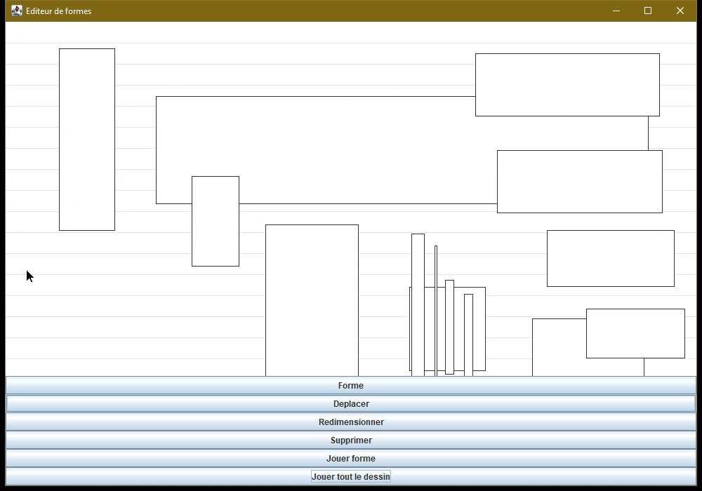

# J'ai tout Finis
# Lecteur de formes - Projet support SLAM5

## Démonstration du projet fini

(sans le son, mais c'est la sixième de Beethov comme on peut le voir facilement)

## Travail à faire

### 1. Implémenter les fonctionnalités absentes

Le projet *commité* ici ne compile pas et il manque des fonctionnalités.

1. Complétez l'implémentation du constructeur de la classe `LecteurDeDessin`.
2. Complétez l'implémentation de la méthode `selectionnerEtJouerLesFormes` de la classe `LecteurDeDessin`.
3. Ajoutez la surcharge constructeur manquante dans la classe `Forme`.
4. Complétez l'implémentation des trois méthodes `contientX`, `contientY` et `contient` de la classe `Forme`.
5. Complétez l'implémentation des trois méthodes `contientLaForme`, `ajouterForme` et `supprimerForme` de la classe `Dessin`.
6. Complétez l'implémentation des deux méthodes `getPremiereFormeEn` et `formesSurLaColonne` de la classe `Dessin`.
7. Compléter l'implémentation de la méthode `pressDansZoneDessin` de la classe `OutilDeplacer`.
8. Compléter l'implémentation des deux méthodes `ajouterAuDessin` et `supprimerDuDessin` de la classe `EditeurDeFormes`.
9. Ajoutez tous les getters et setters nécessaires à la compilation et au bon fonctionnement de l'application.

### 2. Évolution

En plus des formes-rectangles, on va avoir des formes-ovales.

- Le bouton « Forme » courant deviendra « Forme rectangle »
- Ajouter un bouton « Forme ovale » en examinant le traitement actuel des boutons et en dupliquant/adaptant ces fonctionnalités
- Ajouter une classe qui implémente la nouvelle forme en regardant comment la classe `Forme` fonctionne
- Associer un instrument différent et une couleur différente pour les formes ovales

### 3. Refactoring

Vous avez dû prendre conscience de la duplication de code que vous mettiez en place au nombre de copier/coller effectués dans la partie 2. Il y a en effet beaucoup de code réutilisé depuis `OutilForme` et `Forme`. L'objectif est ici de réduire/supprimer la duplication en utilisant l'héritage.

- Concevez la classe abstraite `Forme` dont vont dériver deux classes concrètes `Rectangle` et `Ovale` ; factorisez le code commun dans la classe abstraite
- Concevez la classe abstraite `OutilForme` dont vont dériver deux classes concrètes `OutilRectangle` et `OutilOvale` ; factorisez le code commun dans la classe abstraite

L'ajout de nouvelles formes et des outils associés par la suite sera alors grandement facilité.

**À nous la richesse et le pouvoir.**
# LecteurDeForme
# LecteurDeForme

